# Mehfil · iOS

Operations app for Indian wedding-service vendors — decorators, caterers, photographers, light-and-sound crews. The calendar is the spine, outstanding money is always one tap away, and double-bookings surface before they become a problem.

Built in **SwiftUI for iOS 26 with Liquid Glass**, from the Figma design
[Mehfil](https://www.figma.com/design/HiKVpYsO9qLnUAWF1iZrUY/Untitled?node-id=3-2): 24 screens, 18 components, light and dark. The Android app lives in the sibling repo `mehfil-android`.

<p>
  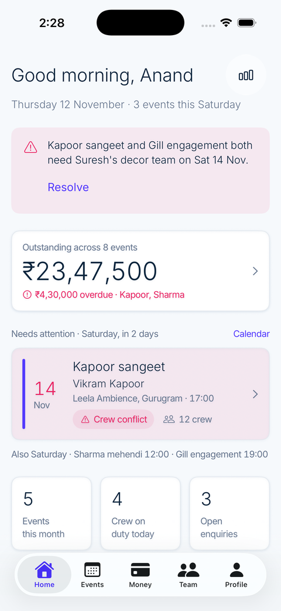
  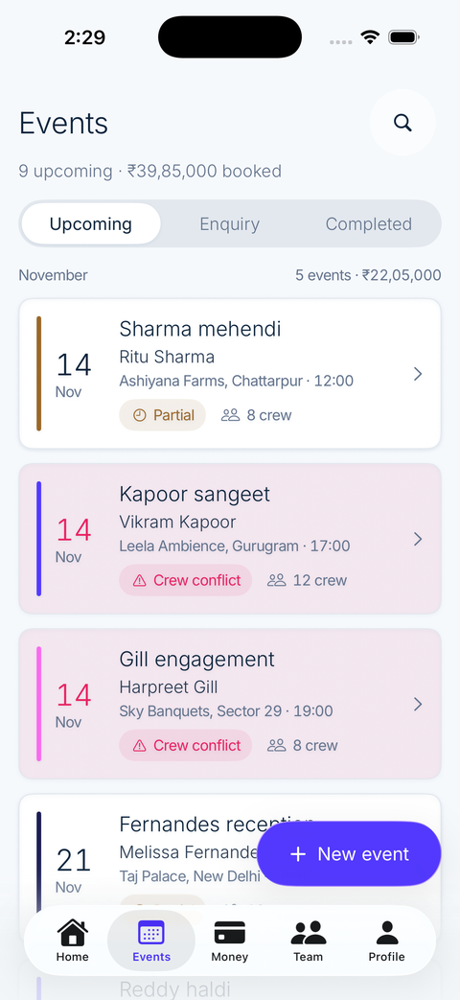
  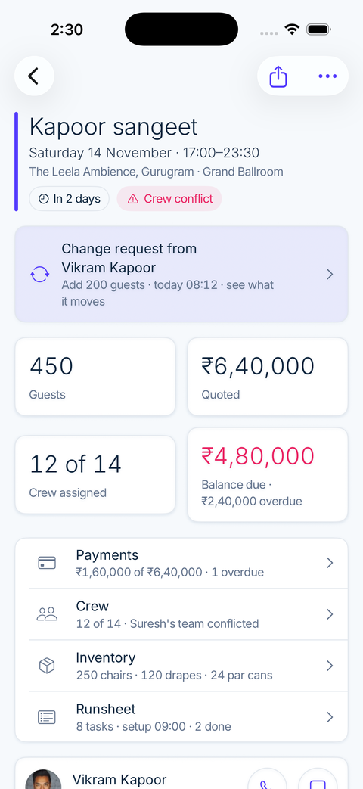
  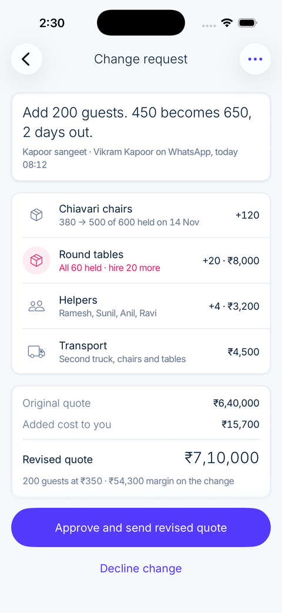
</p>

## What it does

| Flow | Screens |
|---|---|
| **A · Season view** | Home with the conflict banner, outstanding receivables and the event that needs attention · Calendar month with event dots and conflict dates · Day timeline where overlapping events sit side by side · Season summary against target |
| **B · Events** | Segmented list grouped by month · Event hub with summary tiles, collapsible Payments, Crew, Inventory and Runsheet · Two-step create with an inline conflict check the moment a date is picked · Runsheet with completion toggles and reorder · Change request that shows consequences (chairs, tables, helpers, transport) and the revised quote |
| **C · Money** | Receivables grouped Overdue → Due this week → Upcoming · Per-event payment schedule with collection progress · Record payment on a large numeric keypad (never the alphanumeric keyboard) · Reminders with real composed copy in three tones and the history of what was sent before · Expenses with the margin and a loss state |
| **D · Team & inventory** | Crew by role with availability for a chosen date · Assign crew where booked members stay tappable and open a comparison of both events · Attendance with a single-tap three-state control · Inventory with commitment bars and over-committed items first · Item detail with a 30-day commitment strip |
| **E · Clients & system** | Client list with lifetime value and repeat markers · The client-facing shared event page (cream, gradient mesh, always light) · Enquiry intake with the same conflict check · Profile with appearance and settings |

Every amount uses Indian digit grouping (`₹23,47,500`), every string is real content, and every screen that modifies data shows a save state. The event draft survives leaving the create flow.

## Liquid Glass

- System tab bar through the `Tab` API; it minimises on scroll down and hides on pushed screens.
- Glass toolbar and back buttons; `.buttonStyle(.glass)` header actions on tab roots and a `.glassProminent` "New event" action.
- `.glassEffect()` on the toast, the running-total strip above "Create event", and the title chip that floats in when a root screen scrolls.
- Docked primary actions use `safeAreaBar`, so content scrolls under them with the soft edge effect.
- On the shared event page the glass controls pick up the mesh behind them.

<p>
  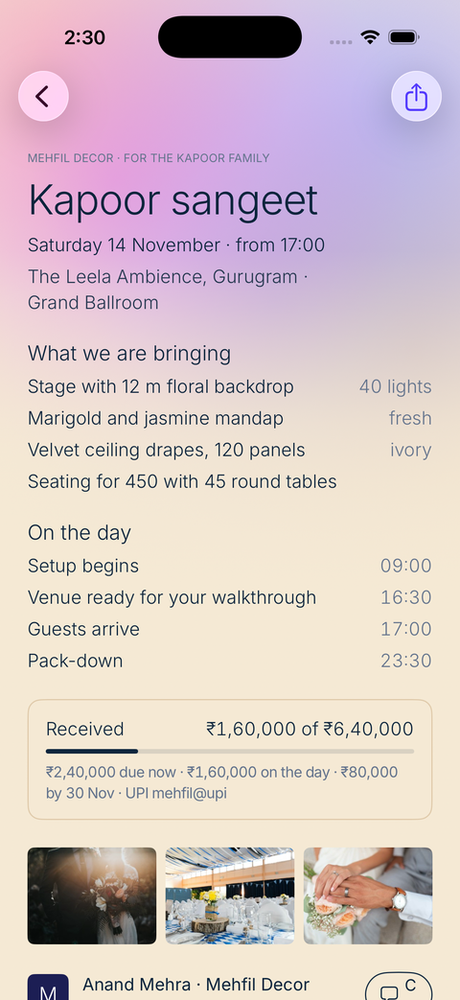
  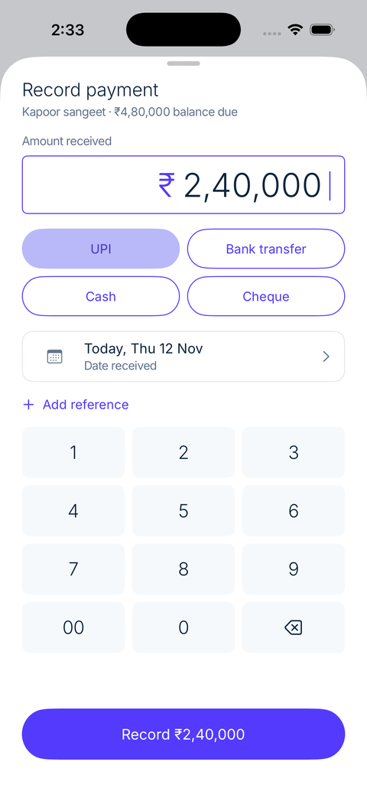
  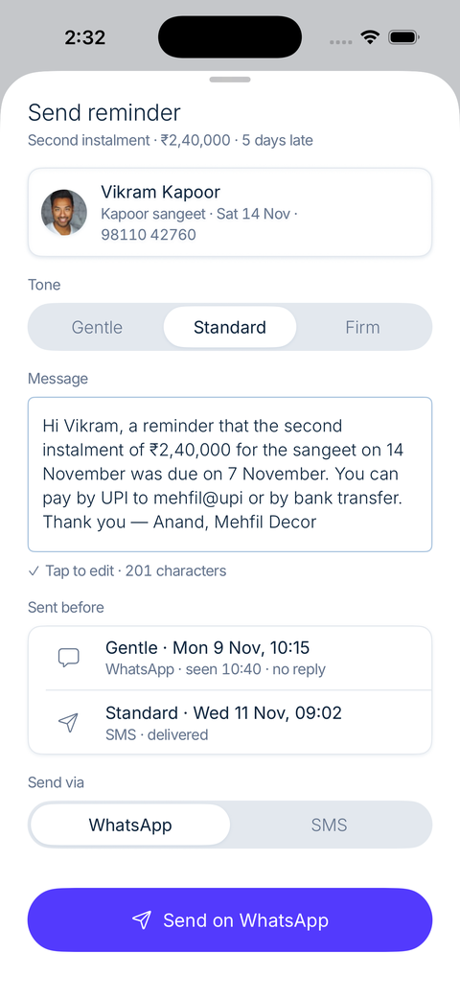
  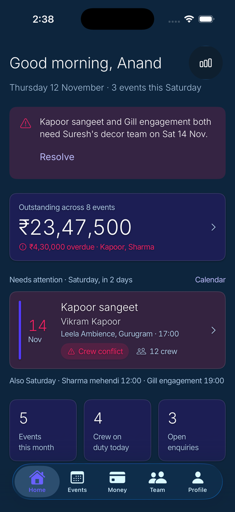
</p>

## Run it

Requires Xcode 26 (iOS 26 SDK). Open `Mehfil.xcodeproj`, pick the **Mehfil** scheme and an iPhone simulator, and run. From the terminal:

```bash
xcodebuild -project Mehfil.xcodeproj -scheme Mehfil -configuration Debug \
  -destination 'platform=iOS Simulator,name=iPhone 17 Pro' CODE_SIGNING_ALLOWED=NO build
```

No backend, no packages: the app runs on an in-memory content model and stores only the appearance setting and the event draft in `UserDefaults`.

## Layout

```
Mehfil/
  MehfilApp.swift            entry, appearance
  Navigation/RootView.swift  TabView + per-tab NavigationStack, routes, toast overlay
  Model/                     Models · SeedData (content model) · AppStore (@Observable) · Format (₹ grouping, dates)
  DesignSystem/              Tokens (light/dark palette, spacing, radii) · Typography (Inter type roles)
                             Components (buttons, chips, inputs, keypad, rows, banners, stepper, segmented, empty, toast)
                             Layouts (screen scaffold, cards, calendar grid, timeline, date strip, sheet scaffold)
  Features/Home | Events | Money | Team | Profile
  Fonts/                     Inter Light/Regular/Medium (SIL Open Font License)
```

## Design notes worth knowing

- "Today" is pinned to **Thu 12 Nov 2026** (`Cal.today`) so the season, conflicts and receivables read exactly as designed. Switch it to `Date()` when real data arrives.
- Tokens come straight from the design's `tokens.css`: ground `#F6F9FC`, surface white, ink `#0D253D`, indigo `#533AFD`, ruby only for danger, and a dark set on ink/brand-navy with the accent lifted to subdued indigo for contrast.
- Decline on the change request is tertiary, not destructive; destructive confirmations name the exact thing being cancelled.
- The client page (E2) has no dark variant on purpose — it is the client's page, opened from a WhatsApp link.

## Screens

<details>
<summary>All 24 screenshots</summary>
<p>
  
  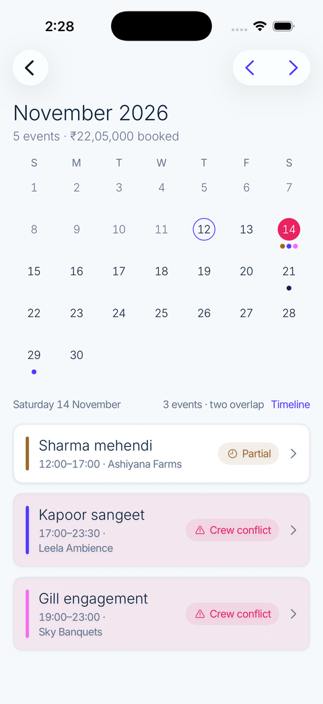
  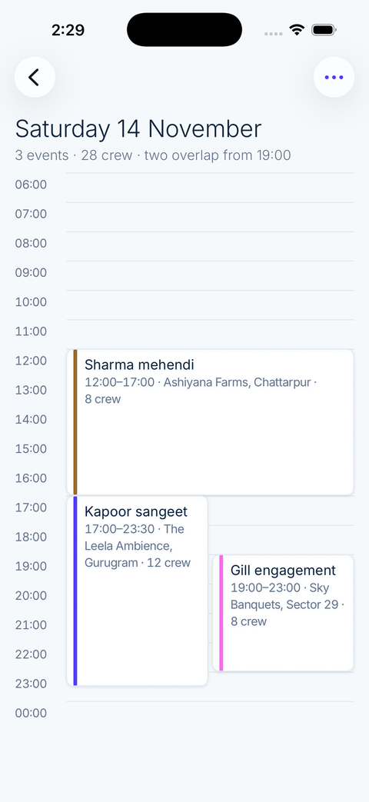
  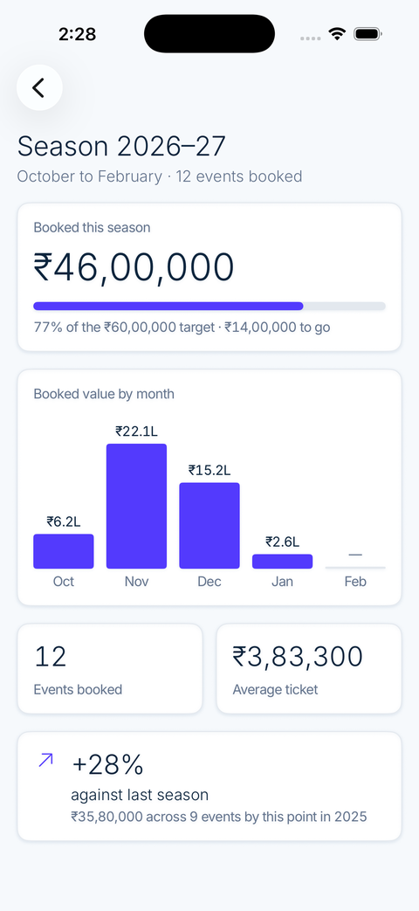
  
  
  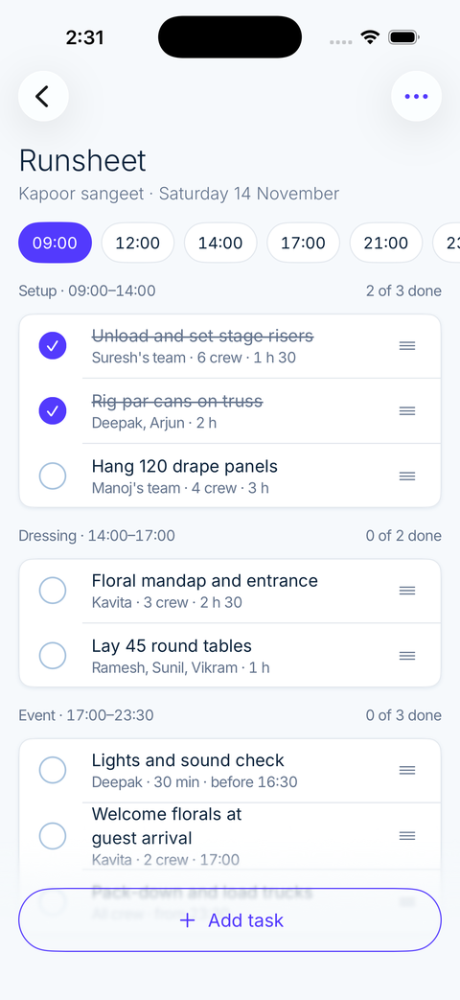
  
  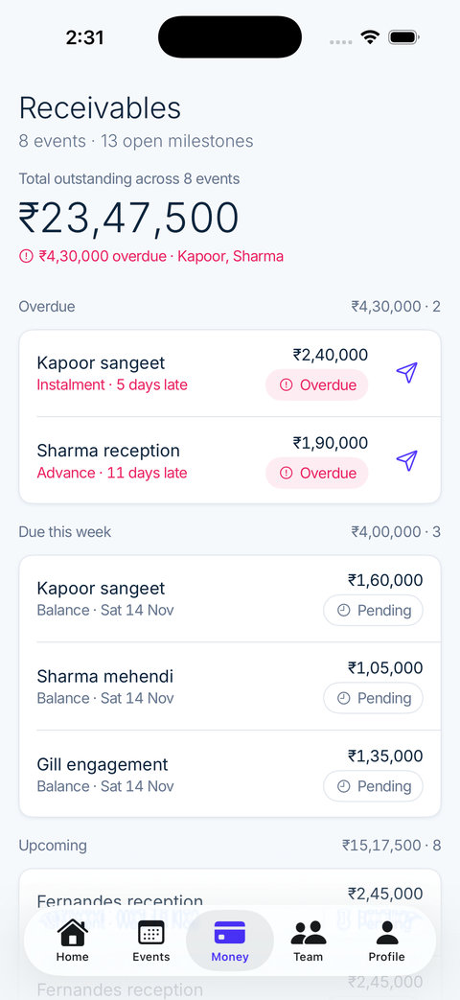
  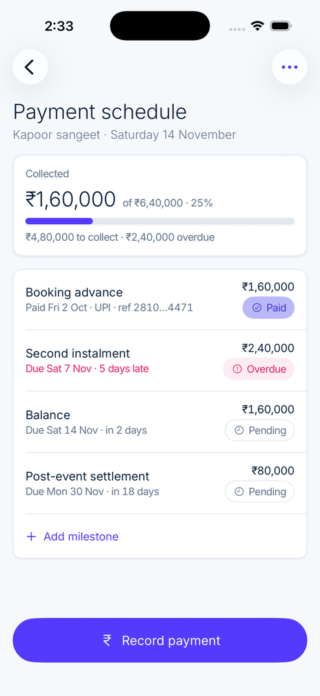
  
  
  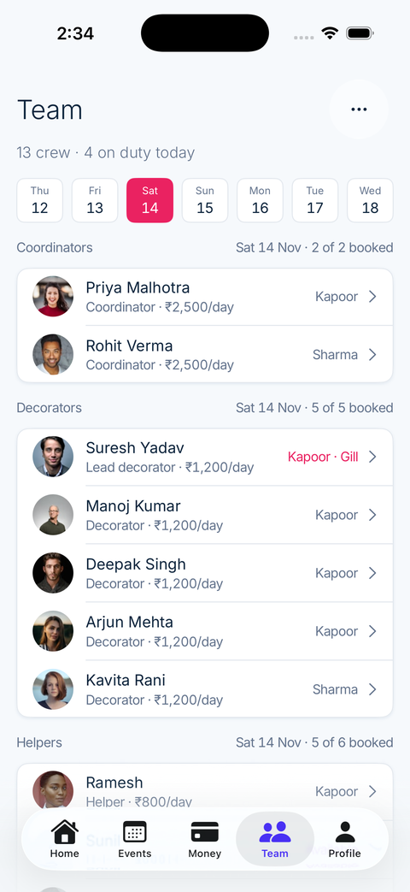
  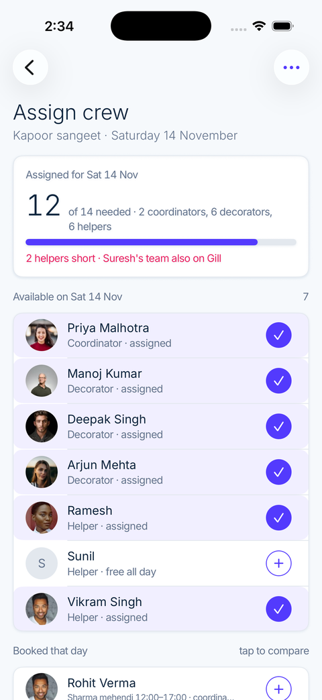
  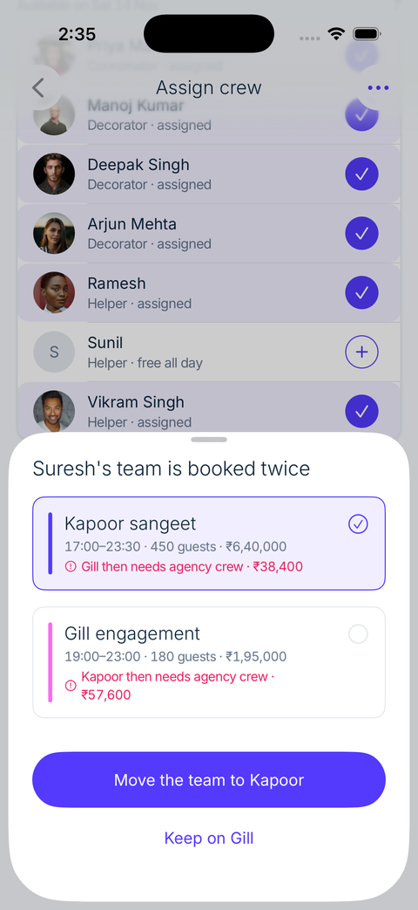
  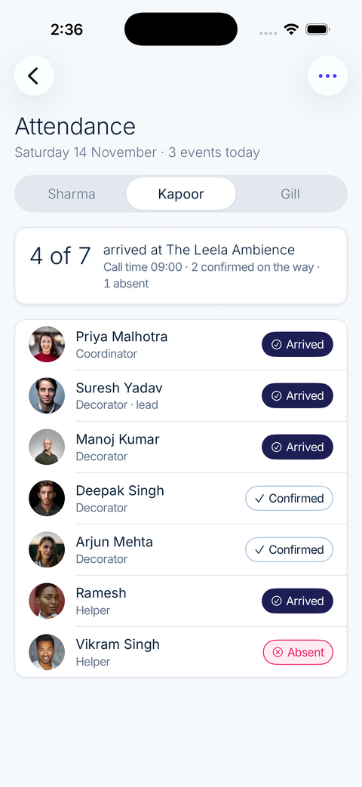
  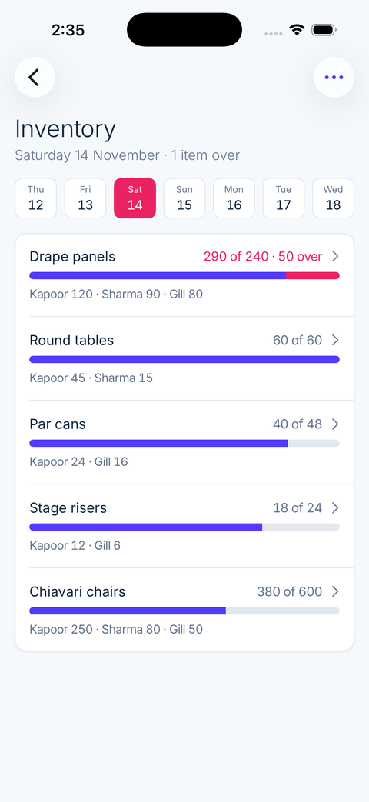
  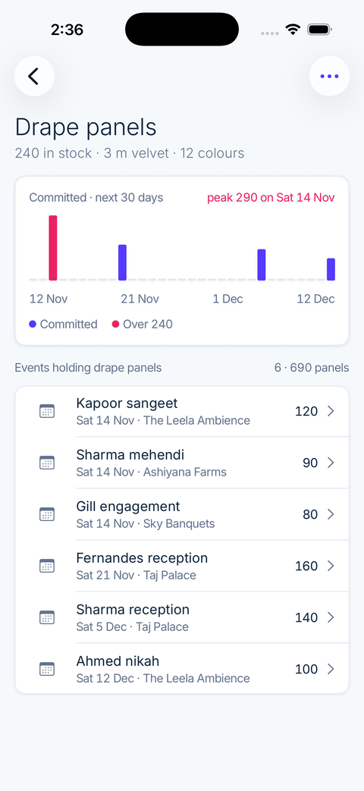
  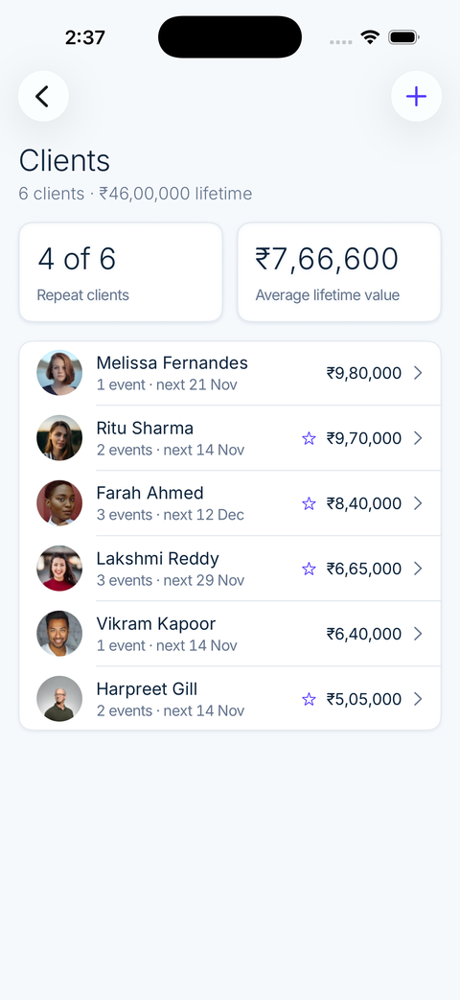
  
  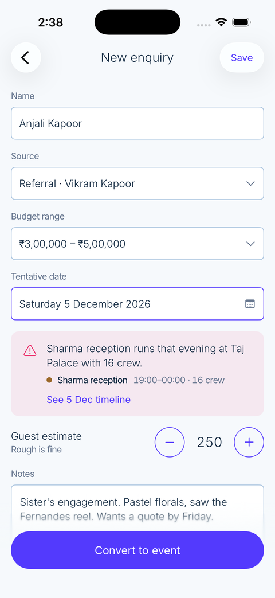
  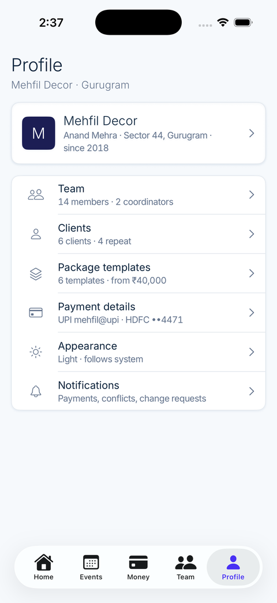
  
  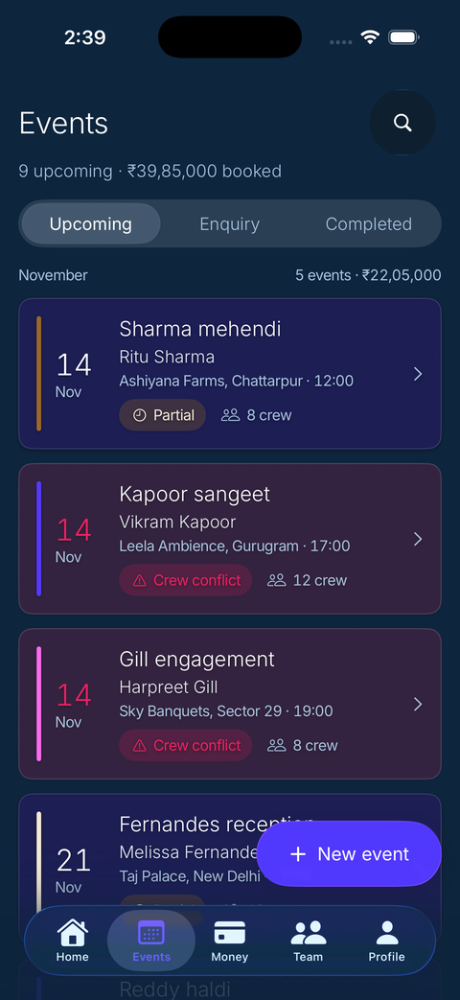
</p>
</details>
